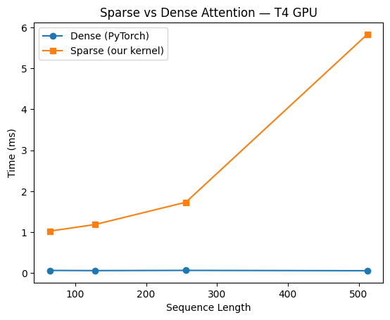
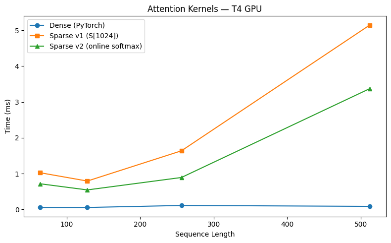

# skip_attention

Sparse flash attention kernel in CUDA, exposed as a PyTorch extension.

## What it does

Implements attention with a sparse mask: local window (`w` nearby tokens) + global stride (every `s` tokens). Tiles with no active pairs are skipped entirely — O(n·w) work vs O(n²) for dense.

Two kernel versions:
- **v1** — tiled shared memory; score array `S[N]` spills to global memory (O(N) registers per thread)
- **v2** — online softmax (Flash Attention style); O(1) registers per thread, ~35–45% faster than v1

## Files

| File | Description |
|------|-------------|
| `sparse_attention.cu` | CUDA kernels (v1 + v2) |
| `sparse_attention_ext.cpp` | PyTorch pybind11 wrapper |
| `setup.py` | Build script |
| `benchmark.ipynb` | Colab notebook: build, test, benchmark |
| `log.md` | Dev log |

## Build

```bash
pip install torch
python setup.py build_ext --inplace
```

Tested on T4 GPU (CUDA 12.8, Python 3.12).

## Usage

```python
import torch
import sparse_attention as sa

N, D = 512, 64
Q = torch.randn(N, D, device='cuda')
K = torch.randn(N, D, device='cuda')
V = torch.randn(N, D, device='cuda')

# Build sparse mask: window=2, stride=4
mask = torch.zeros(N, N, dtype=torch.int32)
for i in range(N):
    for j in range(N):
        if abs(i - j) <= 2 or j % 4 == 0:
            mask[i, j] = 1
mask = mask.cuda()

O = sa.sparse_attention_v2(Q, K, V, mask)   # v2 (online softmax, faster)
# O = sa.sparse_attention(Q, K, V, mask)    # v1
```

## Benchmarks (T4 GPU, head_dim=64, window=2, stride=4)

### v1 vs Dense (PyTorch)



### v1 vs v2 vs Dense (PyTorch)



| N | Dense | v1 | v2 | v2 speedup over v1 |
|---|-------|----|----|-------------------|
| 64 | 0.058 ms | 1.026 ms | 0.717 ms | 1.43× |
| 128 | 0.057 ms | 0.794 ms | 0.547 ms | 1.45× |
| 256 | 0.113 ms | 1.638 ms | 0.894 ms | 1.83× |
| 512 | 0.088 ms | 5.145 ms | 3.371 ms | 1.53× |

> Both custom kernels are slower than PyTorch dense (cuBLAS) at these sequence lengths. The sparsity advantage is expected to appear at N ≥ 2048 where O(n·w) beats O(n²).

## What's next

- Precompute active tile list on CPU → pass as `(row_tile, col_tile)` pairs so GPU never checks, just skips
- Test at N = 2048, 4096
- Wrap in `nn.MultiheadAttention`-compatible Python class
